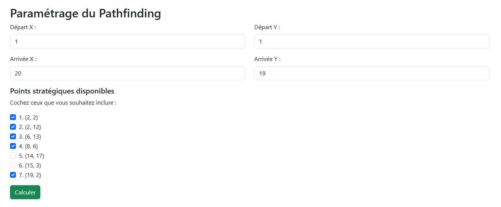

# Pathfinding Web App

Ce projet provient d'un projet d'étude.
C'est une application web en Flask qui permet de calculer un chemin optimal sur une carte en tenant compte de points stratégiques et points d'intérêt.

## Fonctionnalités

- Téléversement de fichiers CSV (`map.csv`, `strategic_points.csv`, `interest_points.csv`).
- Calcul du chemin optimal via BFS et TSP (bitmask).
- Affichage d'informations : coût total, points visités, score.
- Génération d'une image de la carte avec le chemin tracé.

## Prérequis

- Docker

## Installation

1. Cloner le dépôt :

   ```bash
   git clone https://github.com/DorianDescamps/pathfinding
   cd pathfinding
   ```

2. Lancer avec Docker Compose :

   ```bash
   docker compose up -d
   ```

## Structure du projet

```
.
├── app.py               # Routes Flask et intégration logique
├── logic.py             # Implémentation BFS, TSP, rendu d'image
├── templates/           # Templates Jinja2
│   ├── index.html       # Page d'accueil & upload
│   ├── form.html        # Formulaire de saisie des coordonnées
│   ├── result.html      # Affichage du résultat et de la carte
│   └── layout.html      # Mise en page commune
├── src/                 # Fichiers exemples (carte et points)
│   ├── map.csv
│   ├── strategic_points.csv
│   └── interest_points.csv
└── compose.yml          # Configuration Docker Compose
```

## Utilisation

1. Ouvrir dans votre navigateur : `http://localhost:8082`
2. Sur la page d'accueil, téléverser les trois CSV.
3. Sur le formulaire, définir les coordonnées de départ et d'arrivée, et sélectionner les points stratégiques.
4. Valider pour obtenir le chemin optimal et le score.

## Comment ça marche

1. **Lecture et stockage des données**  
   - Les fichiers CSV sont chargés en DataFrame Pandas (`logic.read_csv_from_file`).  
   - La carte contient des coûts de déplacement pour chaque case, avec `-1` pour les obstacles.

2. **BFS pour distances minimales**  
   - À partir de chaque point (départ, arrivée, points stratégiques et d'intérêt), un **Breadth-First Search** (BFS) pondéré calcule le coût minimal jusqu'à toutes les autres cases.  
   - Les résultats produisent une `cost_map` (coût minimal) et une `parent_map` (pour reconstruire le chemin) pour chaque source.

3. **TSP par bitmask**  
   - Les points stratégiques sont d'abord visités dans un ordre optimal grâce à un algorithme de **Traveling Salesman Problem** (TSP) utilisant la programmation dynamique et un masque de bits.  
   - On construit une matrice de distances entre tous les points d'intérêt via les `cost_map` inter-point.

4. **Sélection des points d'intérêt**  
   - Chaque point d'intérêt, associé à un gain, est évalué : on l'ajoute au parcours si le gain couvre le surcoût du détour.  
   - Cette étape maximise le score total (points gagnés – coût du chemin).

5. **Reconstruction du chemin complet**  
   - Une fois l'ordre fixe, on reconstruit chaque segment grâce aux `parent_map` pour obtenir la liste des cases traversées.
   - Une image (PNG) représentant la carte et le chemin est générée avec Matplotlib, puis encodée en Base64 pour affichage dans le navigateur.

## Captures d'écran





## Auteurs

- Dorian Descamps <dorian.descamps601@gmail.com>

